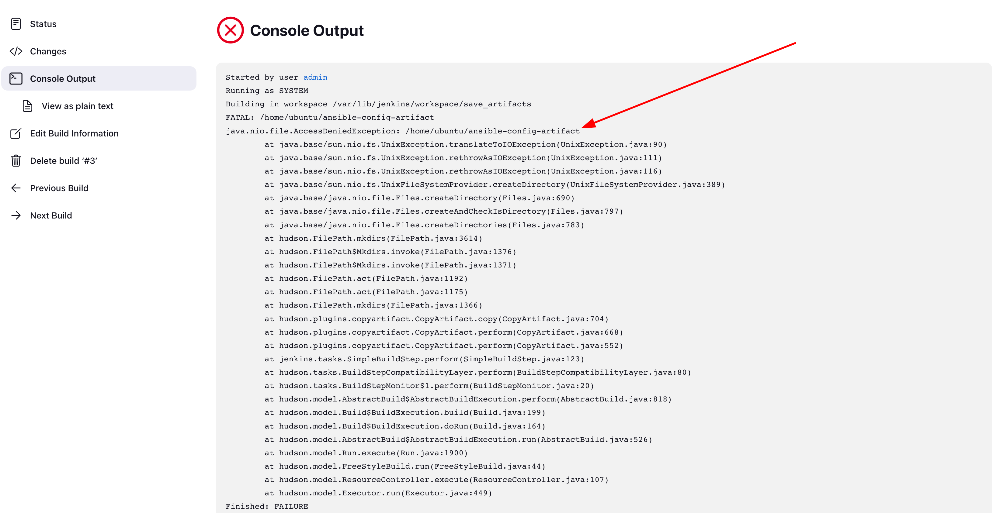
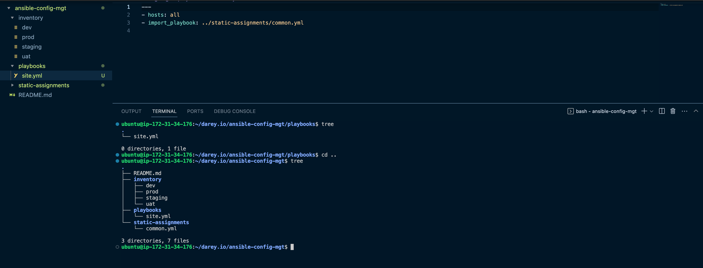
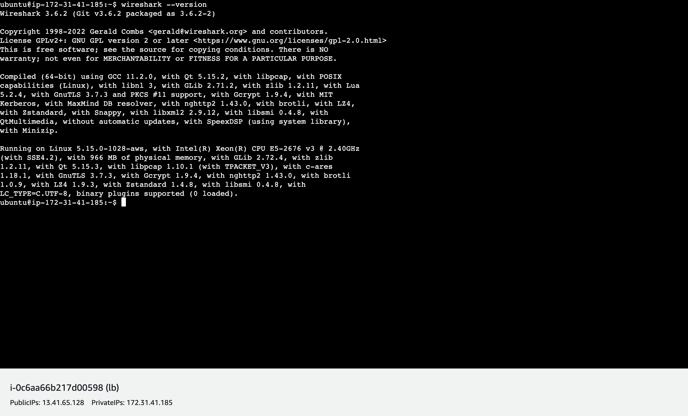
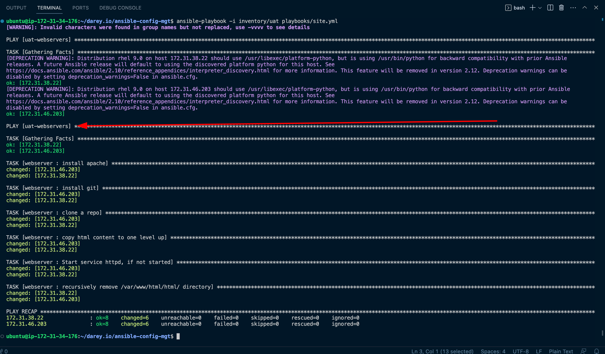
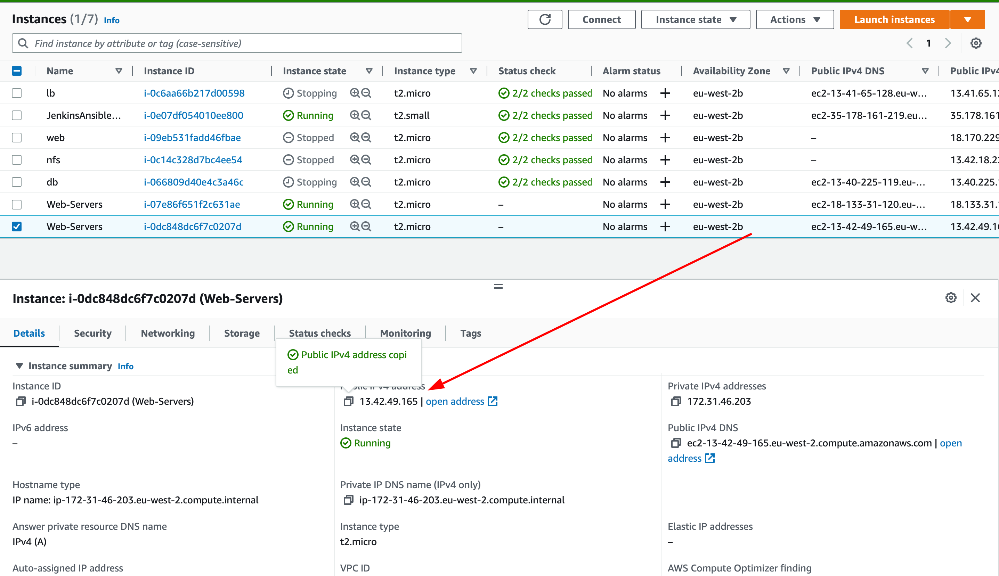
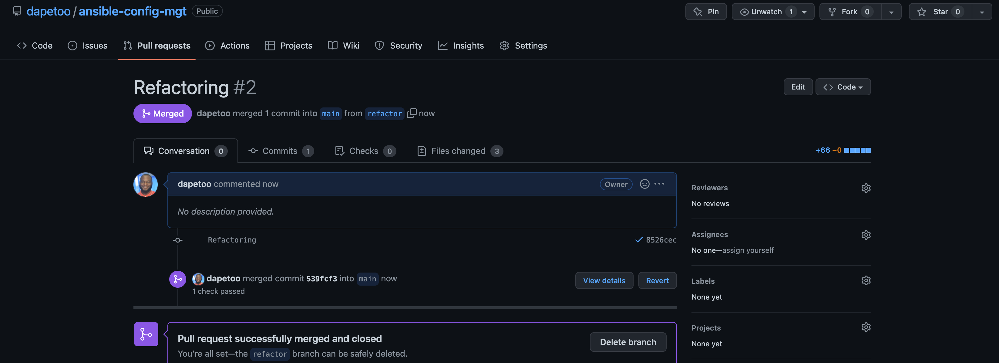

# ANSIBLE REFACTORING AND STATIC ASSIGNMENTS (IMPORTS AND ROLES)

**Code Refactoring**

Refactoring is a general term in computer programming. It means making changes to the source code without changing expected behaviour of the software. The main idea of refactoring is to enhance code readability, increase maintainability and extensibility, reduce complexity, add proper comments without affecting the logic.

Steps

### 1. Jenkins Job Enhancement
- Install a plugin on Jenkins-Ansible server called COPY-ARTIFACTS.
- On the Jenkins-Ansible server, create a new directory called ansible-config-artifact
- Change permission of the directory
- On Jenkin server, create a new Freestyle project and name it save_artifacts.
- Configure the job to copy the artifact created from the pipeline to the folder created above.

```
sudo mkdir /home/ubuntu/ansible-config-artifact
chmod -R 0777 /home/ubuntu/ansible-config-artifact
```

### Step 2 – Refactor Ansible code by importing other playbooks into site.yml
- Within playbooks folder, create a new file and name it site.yml
- Create a new folder in root of the repository and name it static-assignments.
- Move common.yml file into the newly created static-assignments folder
- Inside site.yml file, import common.yml playbook.

```
---
- hosts: all
- import_playbook: ../static-assignments/common.yml
```

- Run ansible-playbook command against the dev environment
- Create another playbook under static-assignments and name it common-del.yml. In this playbook, configure deletion of wireshark utility.

```
---
- name: update web, nfs and db servers
  hosts: webservers, nfs, db
  remote_user: ec2-user
  become: yes
  become_user: root
  tasks:
  - name: delete wireshark
    yum:
      name: wireshark
      state: removed

- name: update LB server
  hosts: lb
  remote_user: ubuntu
  become: yes
  become_user: root
  tasks:
  - name: delete wireshark
    apt:
      name: wireshark-qt
      state: absent
      autoremove: yes
      purge: yes
      autoclean: yes
```

```
cd /home/ubuntu/ansible-config-mgt/


ansible-playbook -i inventory/dev.yml playbooks/site.yaml
```

### Screenshots

### Step 3 – Configure UAT Webservers with a role ‘Webserver’

- Launch 2 fresh EC2 instances using RHEL 8 image, we will use them as our uat servers, so give them names accordingly – Web1-UAT and Web2-UAT.
- Create a role using an Ansible utility called ansible-galaxy inside ansible-config-mgt/roles directory
```
ansible-galaxy init webserver
```

- Update your inventory ansible-config-mgt/inventory/uat.yml file with IP addresses of your 2 UAT Web servers
- In */etc/ansible/ansible.cfg* file uncomment roles_path string and provide a full path to your roles directory roles_path    = /home/ubuntu/ansible-config-mgt/roles, so Ansible could know where to find configured roles.
- Configure the role to install apache2, copy the file from Github to /var/www/html and make sure it can be served using apache

main.yml 
```
---
- name: install apache
  become: true
  ansible.builtin.yum:
    name: "httpd"
    state: present

- name: install git
  become: true
  ansible.builtin.yum:
    name: "git"
    state: present

- name: clone a repo
  become: true
  ansible.builtin.git:
    repo: https://github.com/dapetoo/tooling.git
    dest: /var/www/html
    force: yes

- name: copy html content to one level up
  become: true
  command: cp -r /var/www/html/html/ /var/www/

- name: Start service httpd, if not started
  become: true
  ansible.builtin.service:
    name: httpd
    state: started

- name: recursively remove /var/www/html/html/ directory
  become: true
  ansible.builtin.file:
    path: /var/www/html/html
    state: absent
```

### Step 4 – Reference ‘Webserver’ role
- Within the static-assignments folder, create a new assignment for uat-webservers uat-webservers.yml.

```
---
- hosts: uat-webservers
  roles:
     - webserver
```

updated site.yml
```
---
- hosts: all
- import_playbook: ../static-assignments/common.yml

- hosts: uat-webservers
- import_playbook: ../static-assignments/uat-webservers.yml
```

### Project Screenshots











