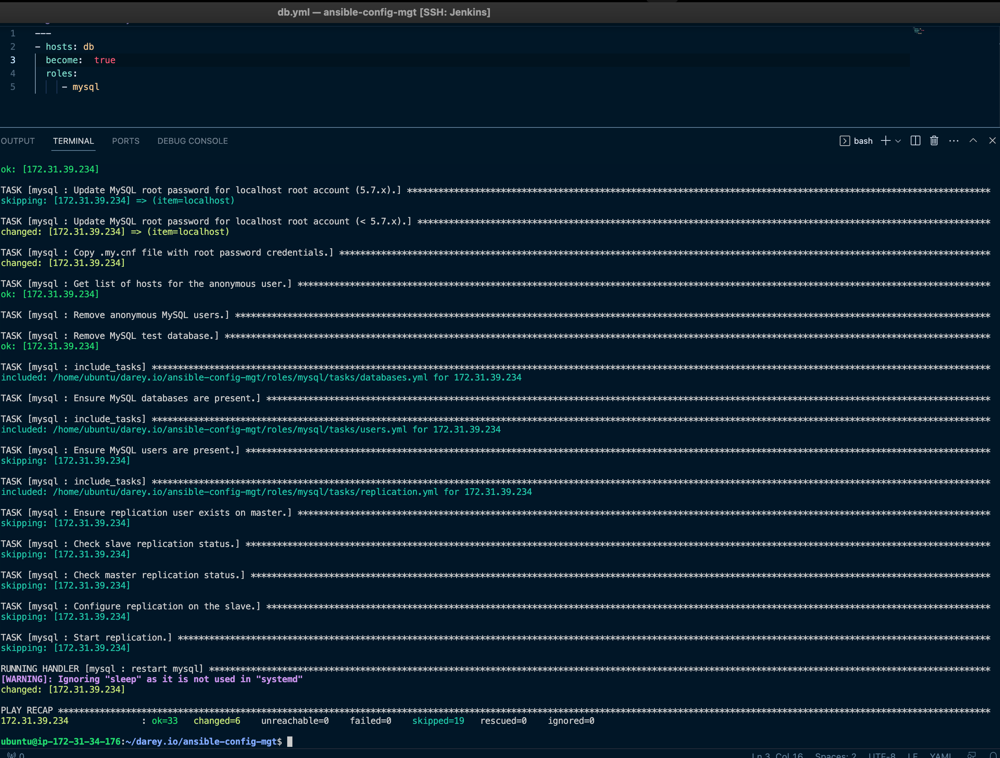

# ANSIBLE DYNAMIC ASSIGNMENTS (INCLUDE) AND COMMUNITY ROLES

Ansible pre-processes all static imports during Playbook parsing time. Dynamic includes are processed during runtime at the point in which that task is encountered.
When it comes to Ansible task options like tags and conditional statements (when:):

For static imports, the parent task options will be copied to all child tasks contained within the import.

For dynamic includes, the task options will only apply to the dynamic task as it is evaluated, and will not be copied to child tasks.

### Using Dynamic assignments
Since we will be using the same Ansible to configure multiple environments, and each of these environments will have certain unique attributes, such as servername, ip-address etc., we will need a way to set values to variables per specific environment.

For this reason, we will now create a folder to keep each environment’s variables file. Therefore, create a new folder env-vars, then for each environment, create new YAML files which we will use to set variables.

project-layout

```
├── dynamic-assignments
│   └── env-vars.yml
├── env-vars
    └── dev.yml
    └── stage.yml
    └── uat.yml
    └── prod.yml
├── inventory
    └── dev
    └── stage
    └── uat
    └── prod
├── playbooks
    └── site.yml
└── static-assignments
    └── common.yml
    └── webservers.yml
```

env-vars.yml

```
---
- name: collate variables from env specific file, if it exists
  hosts: all
  tasks:
    - name: looping through list of available files
      include_vars: "{{ item }}"
      with_first_found:
        - files:
            - dev.yml
            - stage.yml
            - prod.yml
            - uat.yml
          paths:
            - "{{ playbook_dir }}/../env-vars"
      tags:
        - always
```

- Update site.yml 

```
---
- hosts: all
- name: Include dynamic variables 
  tasks:
  import_playbook: ../static-assignments/common.yml 
  include: ../dynamic-assignments/env-vars.yml
  tags:
    - always

-  hosts: webservers
- name: Webserver assignment
  import_playbook: ../static-assignments/webservers.yml
```

#### Installing community ROLES
```
ansible-galaxy search mysql
ansible-galaxy install geerlingguy.mysql
```

#### Load balancer roles 

```
- hosts: lb
  roles:
    - { role: nginx, when: enable_nginx_lb and load_balancer_is_required }
    - { role: apache, when: enable_apache_lb and load_balancer_is_required }
site.yml file

     - name: Loadbalancers assignment
       hosts: lb
         - import_playbook: ../static-assignments/loadbalancers.yml
        when: load_balancer_is_required 
```

### Project Screenshots





