# EXPERIENCE CONTINUOUS INTEGRATION WITH JENKINS | ANSIBLE | ARTIFACTORY | SONARQUBE | PHP

Continuous integration (CI) is the practice of automating the integration of code changes from multiple contributors into a single software project. It’s a primary DevOps best practice, allowing developers to frequently merge code changes into a central repository where builds and tests then run. Automated tools are used to assert the new code’s correctness before integration.


## SIMULATING A TYPICAL CI/CD PIPELINE FOR A PHP BASED APPLICATION


```
├── ci
├── dev
├── pentest
├── pre-prod
├── prod
├── sit
└── uat
```
## Configuring Ansible For Jenkins Deployment

- Navigate to Jenkins URL
- Install & Open Blue Ocean Jenkins Plugin
- Create a new pipeline
- Select GitHub
- Connect Jenkins with GitHub by following the onscreen prompt
- Create a sample Jenkinsfile to run a job on Jenkins server

```
pipeline {
    agent any

  stages {
    stage('Build') {
      steps {
        script {
          sh 'echo "Building Stage"'
        }
      }
    }

    stage('Test') {
      steps {
        script {
          sh 'echo "Testing Stage"'
        }
      }
    }
    }
}
```

### Running Ansible Playbook from Jenkins
- Installing Ansible on Jenkins
- Installing Ansible plugin in Jenkins UI
- Creating Jenkinsfile from scratch. (Delete all you currently have in there and start all over to get Ansible to run successfully)

**Parameterizing Jenkinsfile For Ansible Deployment**

- Update **sit** inventory with new servers
```
[tooling]
<SIT-Tooling-Web-Server-Private-IP-Address>

[todo]
<SIT-Todo-Web-Server-Private-IP-Address>

[nginx]
<SIT-Nginx-Private-IP-Address>

[db:vars]
ansible_user=ec2-user
ansible_python_interpreter=/usr/bin/python

[db]
<SIT-DB-Server-Private-IP-Address>
```

- Update Jenkinsfile to introduce parameterization.

```
pipeline {
    agent any

    parameters {
      string(name: 'inventory', defaultValue: 'dev',  description: 'This is the inventory file for the environment to deploy configuration')
    }
...
```

### CI/CD PIPELINE FOR TODO APPLICATION

**Phase 1 – Prepare Jenkins**

- Fork the repository https://github.com/darey-devops/php-todo.git
- Install PHP, its dependencies and Composer tool on Jenkins server 

```
sudo apt install -y zip libapache2-mod-php phploc php-{xml,bcmath,bz2,intl,gd,mbstring,mysql,zip}
```
- Install Jenkins plugins
Plot plugin
Artifactory plugin

We will use plot plugin to display tests reports, and code coverage information. The Artifactory plugin will be used to easily upload code artifacts into an Artifactory server.

- In Jenkins UI configure Artifactory


**Phase 2 – Integrate Artifactory repository with Jenkins**

- Create a dummy Jenkinsfile in the repository
- Using Blue Ocean, create a multibranch Jenkins pipeline
- On the database server, create database and user

```
Create database homestead;
CREATE USER 'homestead'@'%' IDENTIFIED BY 'sePret^i';
GRANT ALL PRIVILEGES ON * . * TO 'homestead'@'%';
```

- Update the database connectivity requirements in the file .env.sample
- Update Jenkinsfile with proper pipeline configuration

```
pipeline {
    agent any

  stages {

     stage("Initial cleanup") {
          steps {
            dir("${WORKSPACE}") {
              deleteDir()
            }
          }
        }

    stage('Checkout SCM') {
      steps {
            git branch: 'main', url: 'https://github.com/darey-devops/php-todo.git'
      }
    }

    stage('Prepare Dependencies') {
      steps {
             sh 'mv .env.sample .env'
             sh 'composer install'
             sh 'php artisan migrate'
             sh 'php artisan db:seed'
             sh 'php artisan key:generate'
      }
    }
  }
}
```


**Phase 3 – Code Quality Analysis**

- Add the code analysis step in Jenkinsfile. The output of the data will be saved in build/logs/phploc.csv file.

```
stage('Code Analysis') {
  steps {
        sh 'phploc app/ --log-csv build/logs/phploc.csv'

  }
}
```

- Plot the data using plot Jenkins plugin.

```
stage('Plot Code Coverage Report') {
      steps {

            plot csvFileName: 'plot-396c4a6b-b573-41e5-85d8-73613b2ffffb.csv', csvSeries: [[displayTableFlag: false, exclusionValues: 'Lines of Code (LOC),Comment Lines of Code (CLOC),Non-Comment Lines of Code (NCLOC),Logical Lines of Code (LLOC)                          ', file: 'build/logs/phploc.csv', inclusionFlag: 'INCLUDE_BY_STRING', url: '']], group: 'phploc', numBuilds: '100', style: 'line', title: 'A - Lines of code', yaxis: 'Lines of Code'
            plot csvFileName: 'plot-396c4a6b-b573-41e5-85d8-73613b2ffffb.csv', csvSeries: [[displayTableFlag: false, exclusionValues: 'Directories,Files,Namespaces', file: 'build/logs/phploc.csv', inclusionFlag: 'INCLUDE_BY_STRING', url: '']], group: 'phploc', numBuilds: '100', style: 'line', title: 'B - Structures Containers', yaxis: 'Count'
            plot csvFileName: 'plot-396c4a6b-b573-41e5-85d8-73613b2ffffb.csv', csvSeries: [[displayTableFlag: false, exclusionValues: 'Average Class Length (LLOC),Average Method Length (LLOC),Average Function Length (LLOC)', file: 'build/logs/phploc.csv', inclusionFlag: 'INCLUDE_BY_STRING', url: '']], group: 'phploc', numBuilds: '100', style: 'line', title: 'C - Average Length', yaxis: 'Average Lines of Code'
            plot csvFileName: 'plot-396c4a6b-b573-41e5-85d8-73613b2ffffb.csv', csvSeries: [[displayTableFlag: false, exclusionValues: 'Cyclomatic Complexity / Lines of Code,Cyclomatic Complexity / Number of Methods ', file: 'build/logs/phploc.csv', inclusionFlag: 'INCLUDE_BY_STRING', url: '']], group: 'phploc', numBuilds: '100', style: 'line', title: 'D - Relative Cyclomatic Complexity', yaxis: 'Cyclomatic Complexity by Structure'      
            plot csvFileName: 'plot-396c4a6b-b573-41e5-85d8-73613b2ffffb.csv', csvSeries: [[displayTableFlag: false, exclusionValues: 'Classes,Abstract Classes,Concrete Classes', file: 'build/logs/phploc.csv', inclusionFlag: 'INCLUDE_BY_STRING', url: '']], group: 'phploc', numBuilds: '100', style: 'line', title: 'E - Types of Classes', yaxis: 'Count'
            plot csvFileName: 'plot-396c4a6b-b573-41e5-85d8-73613b2ffffb.csv', csvSeries: [[displayTableFlag: false, exclusionValues: 'Methods,Non-Static Methods,Static Methods,Public Methods,Non-Public Methods', file: 'build/logs/phploc.csv', inclusionFlag: 'INCLUDE_BY_STRING', url: '']], group: 'phploc', numBuilds: '100', style: 'line', title: 'F - Types of Methods', yaxis: 'Count'
            plot csvFileName: 'plot-396c4a6b-b573-41e5-85d8-73613b2ffffb.csv', csvSeries: [[displayTableFlag: false, exclusionValues: 'Constants,Global Constants,Class Constants', file: 'build/logs/phploc.csv', inclusionFlag: 'INCLUDE_BY_STRING', url: '']], group: 'phploc', numBuilds: '100', style: 'line', title: 'G - Types of Constants', yaxis: 'Count'
            plot csvFileName: 'plot-396c4a6b-b573-41e5-85d8-73613b2ffffb.csv', csvSeries: [[displayTableFlag: false, exclusionValues: 'Test Classes,Test Methods', file: 'build/logs/phploc.csv', inclusionFlag: 'INCLUDE_BY_STRING', url: '']], group: 'phploc', numBuilds: '100', style: 'line', title: 'I - Testing', yaxis: 'Count'
            plot csvFileName: 'plot-396c4a6b-b573-41e5-85d8-73613b2ffffb.csv', csvSeries: [[displayTableFlag: false, exclusionValues: 'Logical Lines of Code (LLOC),Classes Length (LLOC),Functions Length (LLOC),LLOC outside functions or classes ', file: 'build/logs/phploc.csv', inclusionFlag: 'INCLUDE_BY_STRING', url: '']], group: 'phploc', numBuilds: '100', style: 'line', title: 'AB - Code Structure by Logical Lines of Code', yaxis: 'Logical Lines of Code'
            plot csvFileName: 'plot-396c4a6b-b573-41e5-85d8-73613b2ffffb.csv', csvSeries: [[displayTableFlag: false, exclusionValues: 'Functions,Named Functions,Anonymous Functions', file: 'build/logs/phploc.csv', inclusionFlag: 'INCLUDE_BY_STRING', url: '']], group: 'phploc', numBuilds: '100', style: 'line', title: 'H - Types of Functions', yaxis: 'Count'
            plot csvFileName: 'plot-396c4a6b-b573-41e5-85d8-73613b2ffffb.csv', csvSeries: [[displayTableFlag: false, exclusionValues: 'Interfaces,Traits,Classes,Methods,Functions,Constants', file: 'build/logs/phploc.csv', inclusionFlag: 'INCLUDE_BY_STRING', url: '']], group: 'phploc', numBuilds: '100', style: 'line', title: 'BB - Structure Objects', yaxis: 'Count'

      }
    }
```

- Bundle the application code for into an artifact (archived package) upload to Artifactory
```
stage ('Package Artifact') {
    steps {
            sh 'zip -qr php-todo.zip ${WORKSPACE}/*'
     }
    }
```

- Publish the resulted artifact into Artifactory

```
stage ('Upload Artifact to Artifactory') {
          steps {
            script { 
                 def server = Artifactory.server 'artifactory-server'                 
                 def uploadSpec = """{
                    "files": [
                      {
                       "pattern": "php-todo.zip",
                       "target": "<name-of-artifact-repository>/php-todo",
                       "props": "type=zip;status=ready"

                       }
                    ]
                 }""" 

                 server.upload spec: uploadSpec
               }
            }

        }
```

- Deploy the application to the dev environment by launching Ansible pipeline

```
stage ('Deploy to Dev Environment') {
    steps {
    build job: 'ansible-project/main', parameters: [[$class: 'StringParameterValue', name: 'env', value: 'dev']], propagate: false, wait: true
    }
  }
```

### SONARQUBE INSTALLATION
SonarQube is a tool that can be used to create quality gates for software projects, and the ultimate goal is to be able to ship only quality software code.

Despite that DevOps CI/CD pipeline helps with fast software delivery, it is of the same importance to ensure the quality of such delivery. Hence, we will need SonarQube to set up Quality gates. In this project we will use predefined Quality Gates (also known as The Sonar Way). Software testers and developers would normally work with project leads and architects to create custom quality gates.

**Setting Up SonarQube**
On the Ansible config management pipeline, execute the ansible playbook script to install sonarqube via a preconfigured sonarqube ansible role.

**Configure Sonarqube and Jenkins for Quality Gate**
- In Jenkins, install SonarScanner plugin
- Navigate to configure system in Jenkins. Add SonarQube server: **Manage Jenkins > Configure System**

- Generate authentication token in SonarQube: **User > My Account > Security > Generate Tokens**
- Configure Quality Gate Jenkins Webhook in SonarQube – The URL should point to your Jenkins server http://{JENKINS_HOST}/sonarqube-webhook/ Administration > Configuration > Webhooks > Create
- Setup SonarQube scanner from Jenkins – Global Tool Configuration Manage Jenkins > Global Tool Configuration
- Update Jenkins Pipeline to include SonarQube scanning and Quality Gate

```
stage('SonarQube Quality Gate') {
        environment {
            scannerHome = tool 'SonarQubeScanner'
        }
        steps {
            withSonarQubeEnv('sonarqube') {
                sh "${scannerHome}/bin/sonar-scanner"
            }

        }
    }
```

- Configure sonar-scanner.properties 

```
cd /var/lib/jenkins/tools/hudson.plugins.sonar.SonarRunnerInstallation/SonarQubeScanner/conf/

sudo vi sonar-scanner.properties

sonar.host.url=http://<SonarQube-Server-IP-address>:9000
sonar.projectKey=php-todo
#----- Default source code encoding
sonar.sourceEncoding=UTF-8
sonar.php.exclusions=**/vendor/**
sonar.php.coverage.reportPaths=build/logs/clover.xml
sonar.php.tests.reportPath=build/logs/junit.xml

```

Using a **WHEN** condition
```
stage('SonarQube Quality Gate') {
      when { branch pattern: "^develop*|^hotfix*|^release*|^main*", comparator: "REGEXP"}
        environment {
            scannerHome = tool 'SonarQubeScanner'
        }
        steps {
            withSonarQubeEnv('sonarqube') {
                sh "${scannerHome}/bin/sonar-scanner -Dproject.settings=sonar-project.properties"
            }
            timeout(time: 1, unit: 'MINUTES') {
                waitForQualityGate abortPipeline: true
            }
        }
    }
```

### Project Screenshots
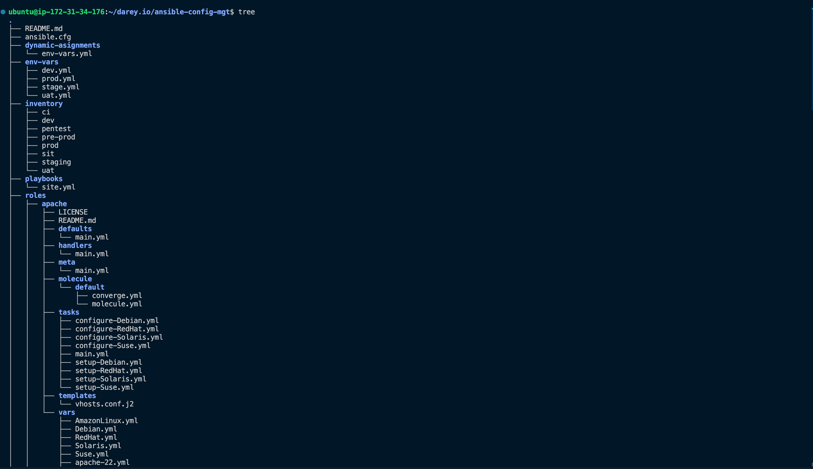

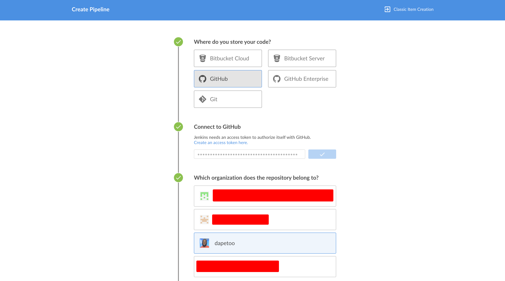
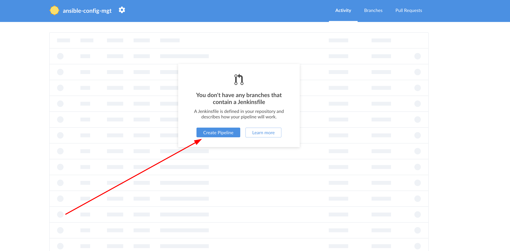
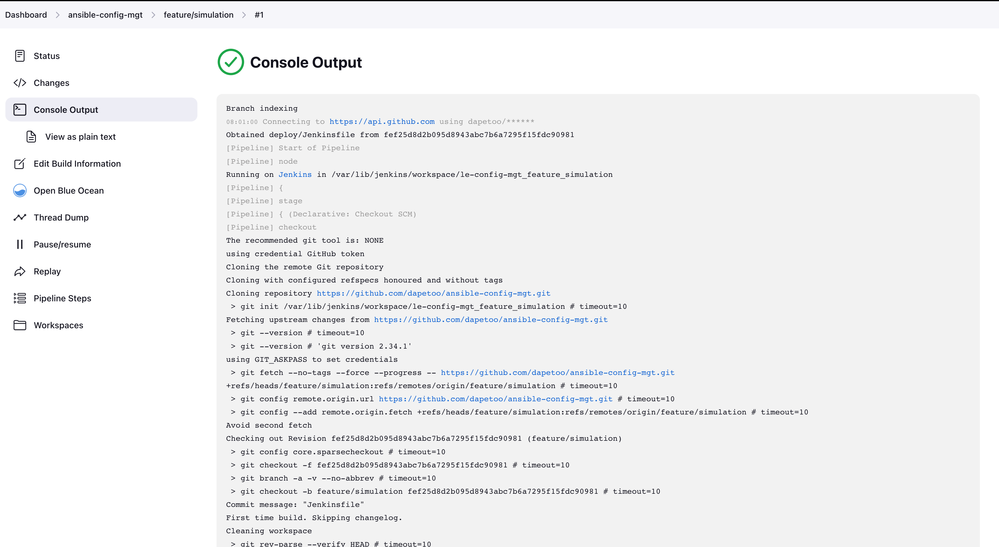

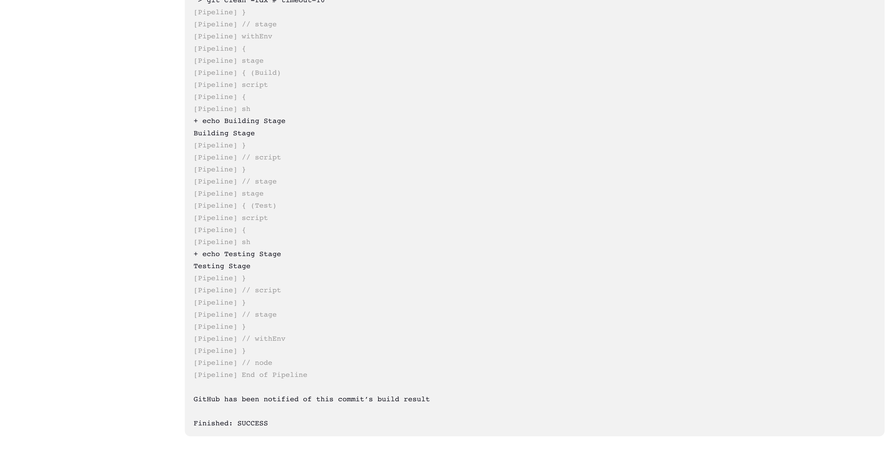


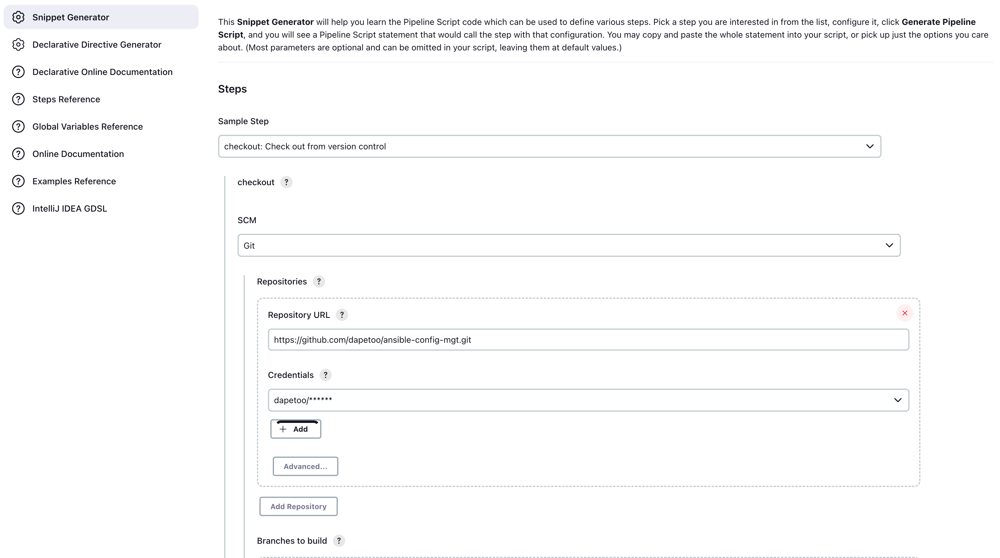
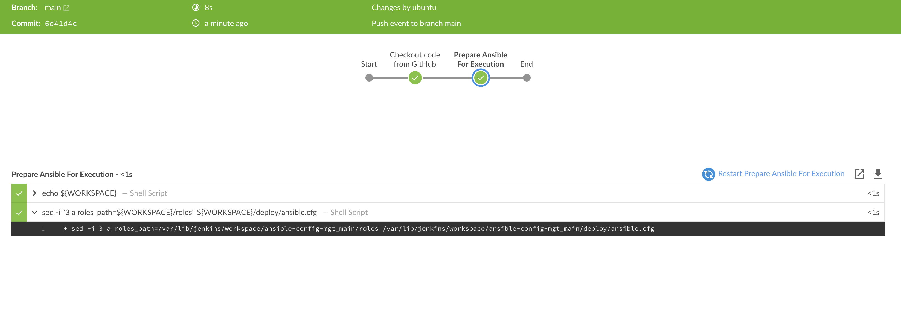
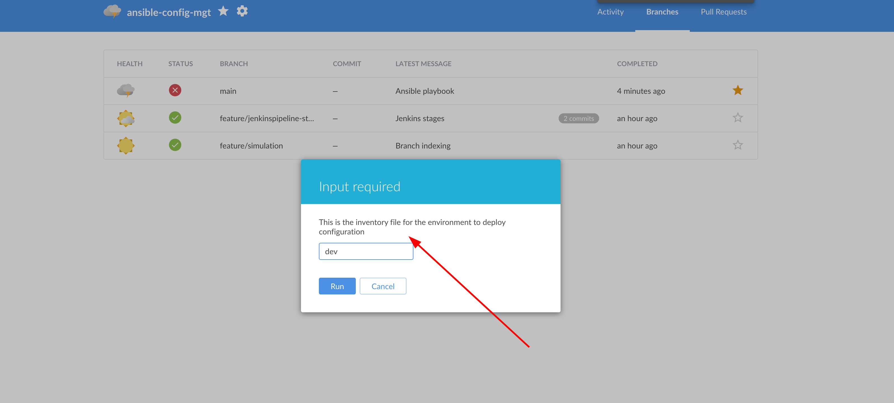
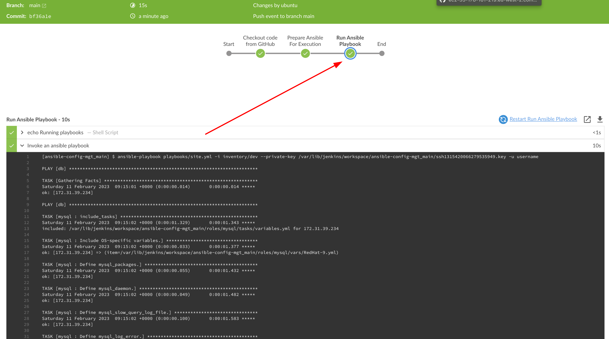
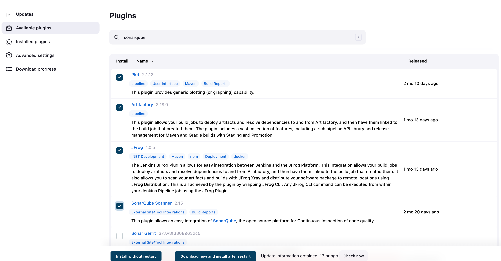
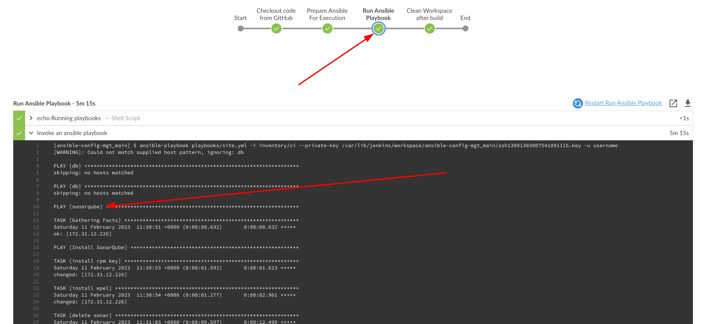
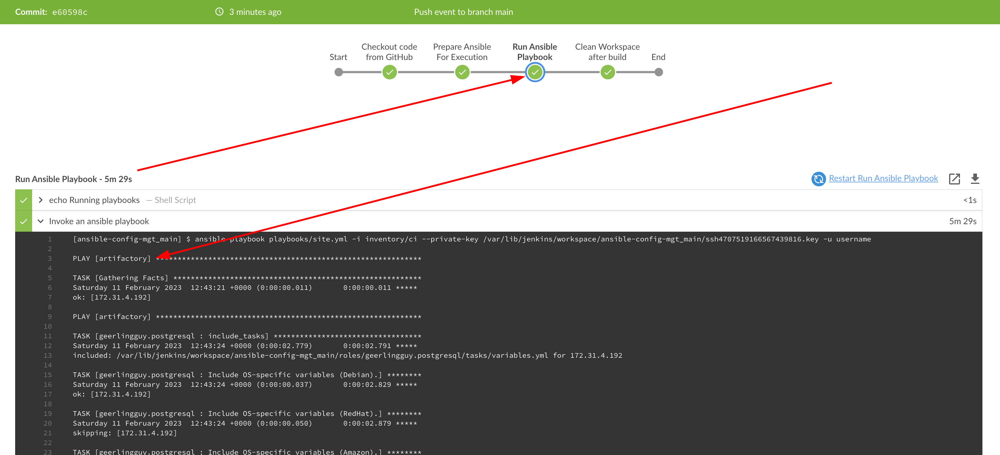
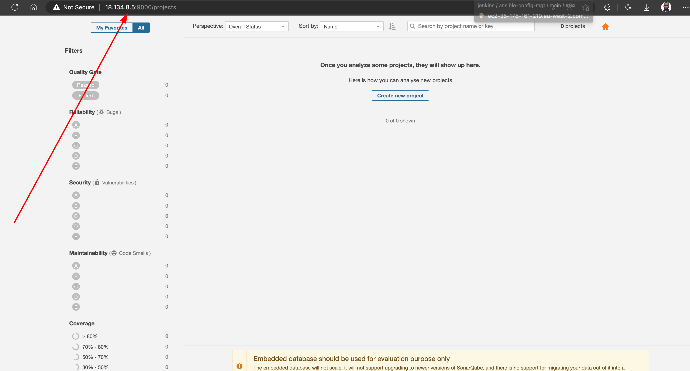
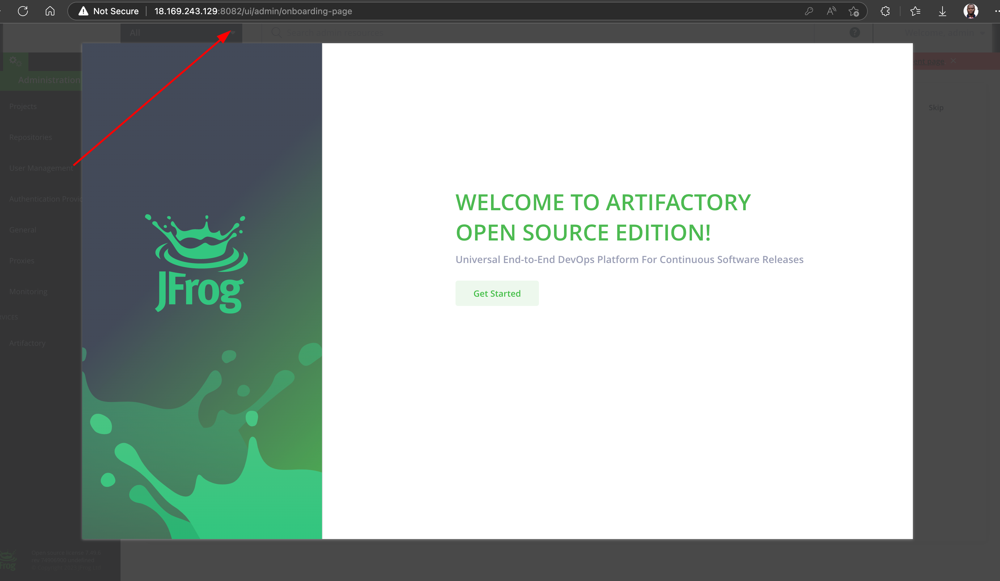


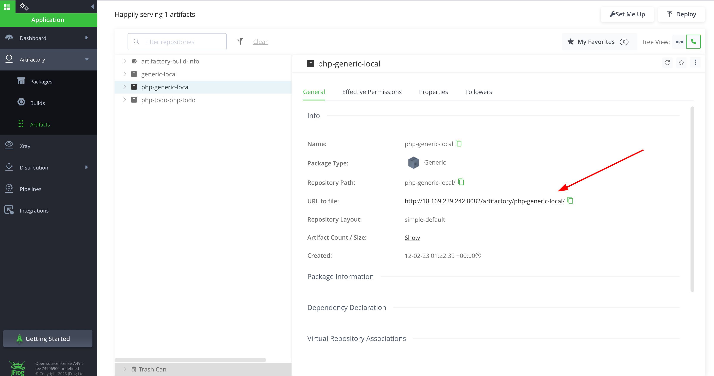

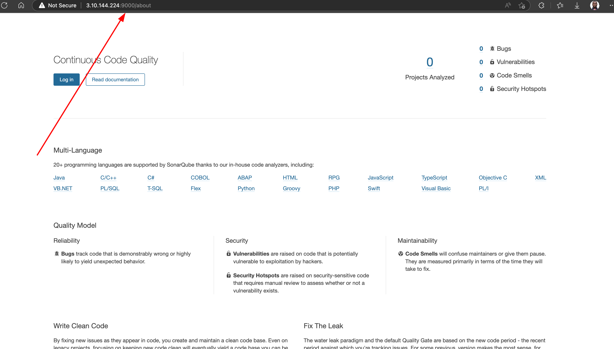
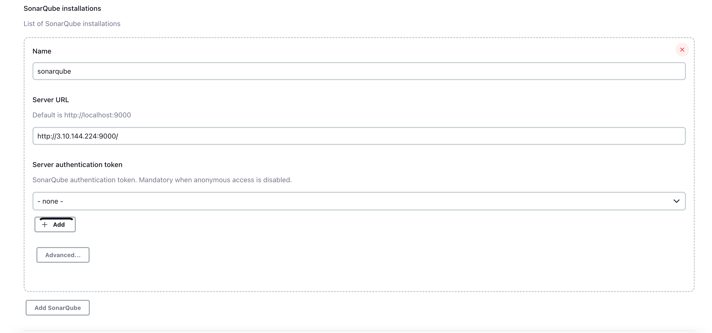


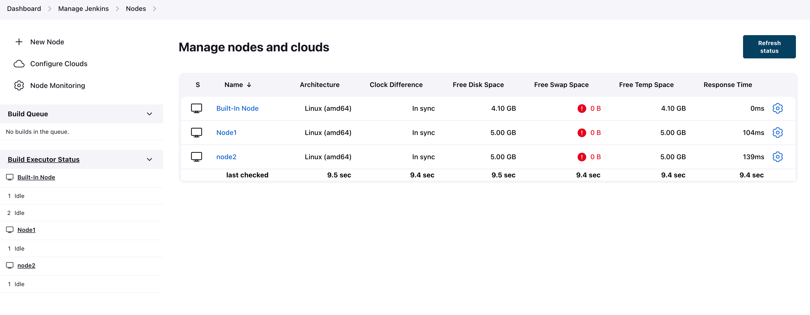


### Project Implementation Repositories

[PHP Todo Repo](https://github.com/scholarship-task/php-todo-redo)

[Ansible Repo](https://github.com/dapetoo/ansible-config-mgt)
